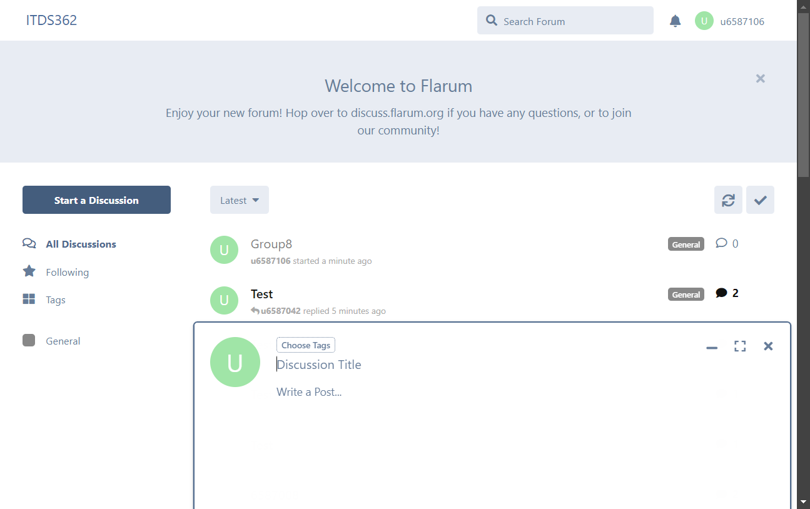
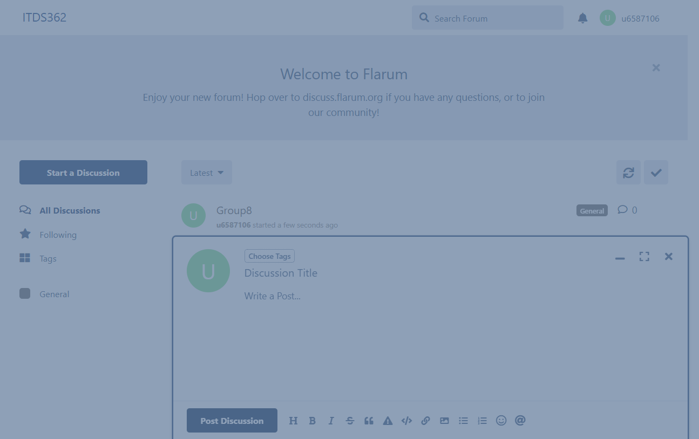

# Group 8 (2024-ITCS362-8)

## Member List:
- **6587037 Supisara Thonglerts**
- **6587057 Pradthana Supawong**
- **6587103 Supisara Ngamchaipisit**
- **6587106 Sitthida Srithanakrittathikarn**

## ITDS362 Forum (http://45.136.236.146:8081/)
---

# Automated UI Testing

## Test Case 1: Sign Up

### 1. Test Successful Sign Up

**Objective**: ตรวจสอบว่าผู้ใช้สามารถลงทะเบียนได้สำเร็จด้วยข้อมูลที่ถูกต้อง

**Steps**:
1. เปิดเว็บเบราว์เซอร์และเข้าหน้า URL [http://45.136.236.146:8081/](http://45.136.236.146:8081/)
2. คลิกปุ่ม **"Sign Up"** เพื่อไปยังหน้าแบบฟอร์มลงทะเบียน
   
3. รอจนกว่าแบบฟอร์มลงทะเบียนจะแสดง (Element ที่มีชื่อ `username` ปรากฏ)
4. กรอกข้อมูลดังนี้:
   - ชื่อผู้ใช้: `u6587103`
   - อีเมล: `supisara.tho@student.mahidol.edu`
   - รหัสผ่าน: `muict555`
   
5. กดปุ่ม **Submit**
6. รอจนกระทั่งมีการแสดงผลการลงทะเบียนสำเร็จ (ปุ่มที่บ่งบอกการเป็นผู้ใช้)
   
7. ปิดเบราว์เซอร์

---

### 2. Test Failed Sign Up

**Objective**: ตรวจสอบการลงทะเบียนที่ล้มเหลวเนื่องจากข้อมูลไม่เป็นไปตามข้อกำหนด เช่น ชื่อผู้ใช้สั้นเกินไป, อีเมลซ้ำ, หรือรหัสผ่านไม่แข็งแรง

**Steps**:
1. เปิดเว็บเบราว์เซอร์และเข้าหน้า URL [http://45.136.236.146:8081/](http://45.136.236.146:8081/)
2. คลิกปุ่ม **"Sign Up"**
3. รอจนหน้าแบบฟอร์มแสดง
   
4. กรอกข้อมูลผิดพลาด:
   - ชื่อผู้ใช้: `mu` (สั้นเกินไป)
   - อีเมล: `sitthida.sri@student.mahidol.edu` (ซ้ำในระบบ)
   - รหัสผ่าน: `ict555` (ไม่แข็งแรง)
   
5. กดปุ่ม **Submit**
6. รอจนข้อความแจ้งเตือนแสดงผล ตรวจสอบข้อความดังนี้:
   - "The username must be at least 3 characters."
   - "The email has already been taken."
   - "The password must be at least 8 characters."
   
7. ปิดเบราว์เซอร์
---

### 3. Test Failed Sign Up (Duplicate Data)

**Objective**: ตรวจสอบการลงทะเบียนที่ล้มเหลวเมื่อข้อมูลที่กรอก (เช่น ชื่อผู้ใช้หรืออีเมล) ถูกใช้งานไปแล้ว

**Steps**:
1. เปิดเว็บเบราว์เซอร์และเข้าหน้า URL [http://45.136.236.146:8081/](http://45.136.236.146:8081/)
2. คลิกปุ่ม **"Sign Up"**
3. รอจนหน้าแบบฟอร์มแสดง
   
4. กรอกข้อมูลดังนี้:
   - ชื่อผู้ใช้: `u6587106`
   - อีเมล: `sitthida.sri@student.mahidol.edu`
   - รหัสผ่าน: `muict555`
   
5. กดปุ่ม **Submit**
6. รอจนข้อความแจ้งเตือนแสดงผล ตรวจสอบข้อความดังนี้:
   - "The username has already been taken."
   - "The email has already been taken."
   
7. ปิดเบราว์เซอร์

---

## Test Case 2: Discussion

### 1. Test Successful Discussion

**Objective**: Vตรวจสอบว่าโพสต์ Discussion สำเร็จเมื่อป้อนข้อมูลถูกต้องครบถ้วน

**Steps**:
1. เปิดเว็บเบราว์เซอร์และเข้าหน้า URL [http://45.136.236.146:8081/](http://45.136.236.146:8081/)
2. เรียกใช้ Keyword **Login To System** เพื่อเข้าสู่ระบบ
   
3. คลิกปุ่ม **"New Discussion"** โดยเรียกใช้ Keyword **Click New Discussion**
   
4. เลือกแท็ก **"General"**:
   - คลิกปุ่มเลือกแท็ก
   
   - รอให้แท็ก **"General"** ปรากฏและเลือกแท็ก
   
   - คลิกปุ่ม **"OK"** เพื่อยืนยันการเลือกแท็ก
5. ป้อนข้อมูลที่ถูกต้องในฟิลด์ต่าง ๆ:
   - ชื่อเรื่อง: `Group8`
   
   - เนื้อหา: `Test`
   
6. คลิกปุ่ม **"Post Discussion"**
   
7. ปิดเบราว์เซอร์

---

### 2. Test Failed Discussion (No Input)

**Objective**: ตรวจสอบว่าระบบแสดงข้อผิดพลาดเมื่อไม่มีการกรอกข้อมูลในฟิลด์ที่จำเป็น (Title และ Post Content)

**Steps**:
1. เปิดเว็บเบราว์เซอร์และเข้าหน้า URL [http://45.136.236.146:8081/](http://45.136.236.146:8081/)
2. เรียกใช้ Keyword **Login To System** เพื่อเข้าสู่ระบบ
   
3. คลิกปุ่ม **"New Discussion"**
   
4. ไม่ใส่ค่า **Tag**, **Title** และ **Post Content**
5. คลิกปุ่ม **"Post Discussion"**
   
6. รอให้ข้อความแสดงผลข้อผิดพลาด (เช่น "กรุณาเลือกแท็ก")
   
7. ปิดเบราว์เซอร์

---

### 3. Test Failed Discussion (Invalid Title and Content)

**Objective**: ตรวจสอบว่าระบบแสดงข้อผิดพลาดเมื่อไม่มีการป้อนข้อมูล Title และ Post Content แต่เลือกแท็กสำเร็จ

**Steps**:
1. เปิดเว็บเบราว์เซอร์และเข้าหน้า URL [http://45.136.236.146:8081/](http://45.136.236.146:8081/)
2. เรียกใช้ Keyword **Login To System** เพื่อเข้าสู่ระบบ
   
3. คลิกปุ่ม **"New Discussion"**
   
4. เลือกแท็ก **"General"**
   
5. ไม่ใส่ค่า **Title** และ **Post Content**
6. คลิกปุ่ม **"Post Discussion"**
   
7. ตรวจสอบข้อความข้อผิดพลาด:
   - "The title field is required."
   
8. ปิดเบราว์เซอร์

---

### 4. Test Failed Discussion (Short Title)

**Objective**: ตรวจสอบว่าระบบแสดงข้อผิดพลาดเมื่อกรอก Title ที่มีความยาวน้อยกว่า 3 ตัวอักษร

**Steps**:
1. เปิดเว็บเบราว์เซอร์และเข้าหน้า URL [http://45.136.236.146:8081/](http://45.136.236.146:8081/)
2. เรียกใช้ Keyword **Login To System** เพื่อเข้าสู่ระบบ
   
3. คลิกปุ่ม **"New Discussion"**
   
4. เลือกแท็ก **"General"**
   
5. ป้อน Title เป็น `mu` (ความยาวน้อยกว่า 3 ตัวอักษร)
6. คลิกปุ่ม **"Post Discussion"**
   
7. ตรวจสอบข้อความข้อผิดพลาด:
   - "The title must be at least 3 characters."
   
8. ปิดเบราว์เซอร์

---

## Test Case 3: Login

### 1. Test Successful Login with Username

**Objective**: ตรวจสอบการเข้าสู่ระบบสำเร็จเมื่อใช้ username ที่ถูกต้อง

**Steps**:
1. เปิดเว็บเบราว์เซอร์และเข้าหน้า URL [http://45.136.236.146:8081/](http://45.136.236.146:8081/)
2. คลิกปุ่ม **"Log In"**!
   
3. รอให้ฟิลด์กรอกข้อมูล `identification` ปรากฏ
4. กรอก **username** และ **password** ที่ถูกต้อง
   
5. คลิกปุ่ม **Submit**
6. รอให้ไอคอน หรือหน้าจอแสดงว่าการเข้าสู่ระบบสำเร็จ
   
7. ปิดเบราว์เซอร์
---

### 2. Test Successful Login with Email

**Objective**: ตรวจสอบการเข้าสู่ระบบสำเร็จเมื่อใช้ email ที่ถูกต้อง

**Steps**:
1. เปิดเว็บเบราว์เซอร์และเข้าหน้า URL [http://45.136.236.146:8081/](http://45.136.236.146:8081/)
2. คลิกปุ่ม **"Log In"**
   
3. กรอก **email** และ **password** ที่ถูกต้อง
   
4. คลิกปุ่ม **Submit**
5. รอให้ไอคอน หรือหน้าจอแสดงว่าการเข้าสู่ระบบสำเร็จ
   
6. ปิดเบราว์เซอร์

---

### 3. Test Failed Login

**Objective**: ตรวจสอบการเข้าสู่ระบบล้มเหลวเมื่อข้อมูลที่กรอก (ชื่อผู้ใช้หรือรหัสผ่าน) ผิด

**Steps**:
1. เปิดเว็บเบราว์เซอร์และเข้าหน้า URL [http://45.136.236.146:8081/](http://45.136.236.146:8081/)
2. คลิกปุ่ม **"Log In"**
   
3. กรอกชื่อผู้ใช้หรือรหัสผ่านที่ไม่ถูกต้อง
   
4. คลิกปุ่ม **Submit**
5. รอข้อความข้อผิดพลาด:
   - "Your login details were incorrect."
   
6. ปิดเบราว์เซอร์

---

## Keywords

### Login To System

1. การจัดการกระบวนการเข้าสู่ระบบ:
   - คลิกปุ่ม **"Log In"**
   - กรอก **username** (`${USERNAME}`) และ **password** (`${PASSWORD}`)
   - คลิกปุ่ม **Submit**

### Click New Discussion

1. เข้าสู่หน้าฟอร์ม Discussion:
   - รอจนปุ่ม **"New Discussion"** ปรากฏ
   - คลิกปุ่มเพื่อเข้าสู่หน้าฟอร์ม
